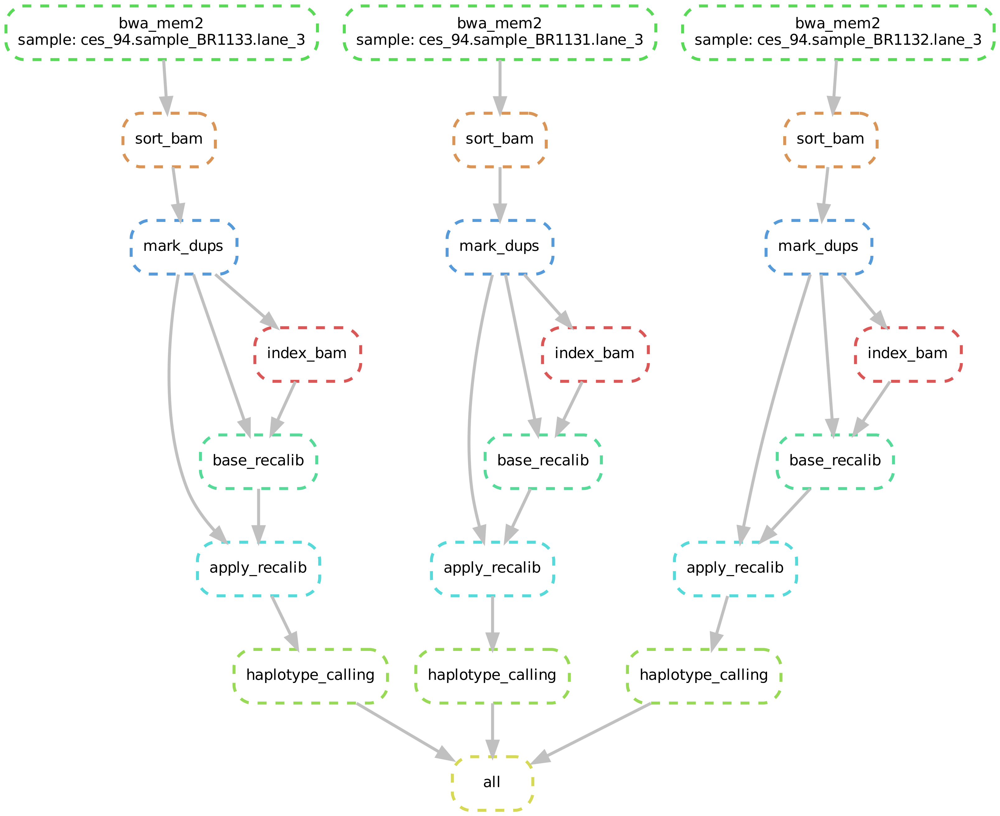

# Pipeline for WES re-analysis for REX project

The pipeline is created for the uniform re-alignment and re-analysis of WES/CES samples for the Russian Exome Project. The software is available as a Docker image to ensure maximum reproducibility of the results and easy transfer to different laboratories for easing the data intgeration process. The repository contains two most imporant files:

`Dockerfile` is the recipe for creating a Docker image with pipeline and resource files used by GATK/BROAD

`Snakefile` is the main pipeline script written in Snakemake (Snakameke v.6 or higher is required). An example DAG of jobs of the pipeline (for three samples) is included below:



## Building and installation

The pre-built image and resource files which are needed to run the build are available at Yandex.Disk: https://disk.yandex.ru/d/MLKp3X77F7ycwQ?w=1. 

If you use the pre-built image, run the following command to load it into the local Docker repository:

```
docker load -i rex_v1.img.tar.gz
```

To run the pipeline in Docker, all FASTQ files must be gzip-compressed and stored in one directory (no symlinks allowed). You can use the following command to start the container and run the pipeline:

```
docker run -v /path/to/your/files:/input \
           -v /path/to/preferred/output/dir:/output 
           --cpus <number of threads> -it rex:latest \
           snakemake -s /gatk/pipelines/Snakefile -j <number of threads>
```

Please note that the number of CPUs has to be specified twice - once as the maximum number of threads that can be used by the Docker daemon, and once to pass the number of threads to the Snakemake (this number will be used for scaling).

To build the image from scratch, please run the following command in the directory with all files downloaded from Yandex.Disk:

```
docker build --tag rex ./
```
